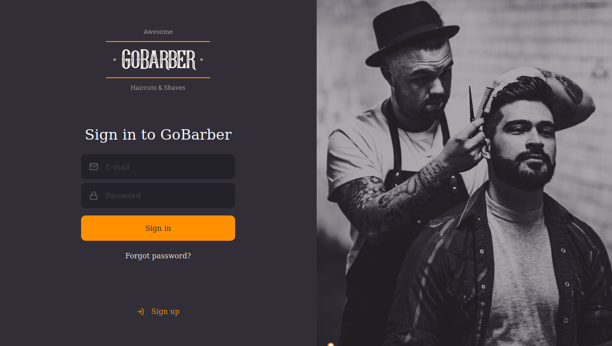

<h1 align="center">
  
</h1>

<p align="center" >
  <a href="#framed_picture-preview"> 🖼️ Preview</a> |
  <a href="#construction-preview"> 🚧 Project</a> |
  <a href="#rocket-technologies"> 🚀 Technologies</a> |
  <a href="#zap-getting-started"> ⚡ Getting started</a>
</p>


<p align="center">
  <a href="https://god.postman.co/run-collection/def82ca5e3c78ed55ac9">
   
  </a>
</p>


<h2 align="center">The best haircut and beard trim of your life!</h2>

## 🖼️ Preview




## 🚧 Project

This is the GoBarber API, which provides everything you need to manage your own barbershop, ranging from endpoints that costumers can book an appointment to a comprehensive dashboard, so that barbers can see their schedule for day.


[Web Client](https://github.com/pedrozocatelli/gobarber-web)

## 🚀 Technologies

- [Node.js](https://nodejs.org/en/)
- [TypeScript](https://www.typescriptlang.org/)
- [ExpressJS](https://expressjs.com/pt-br/)
- [AmazonSES](https://aws.amazon.com/pt/ses/)
- [AmazonS3](https://aws.amazon.com/pt/s3/)
- [TypeORM](https://typeorm.io/#/)
- [Mime](https://www.npmjs.com/package/mime)
- [PostgresSQL](https://www.postgresql.org/)
- [MongoDB](https://www.mongodb.com/)
- [Redis](https://redis.io/)
- [IORedis](https://github.com/luin/ioredis)
- [JWT](https://jwt.io/)
- [date-fns](https://date-fns.org/)
- [Jest](https://jestjs.io/)


## ⚡ Getting started
```sh
$ git clone git@github.com:pedrozocatelli/gobarber-api
$ cd gobarber-api
$ docker-compose up -d
```
